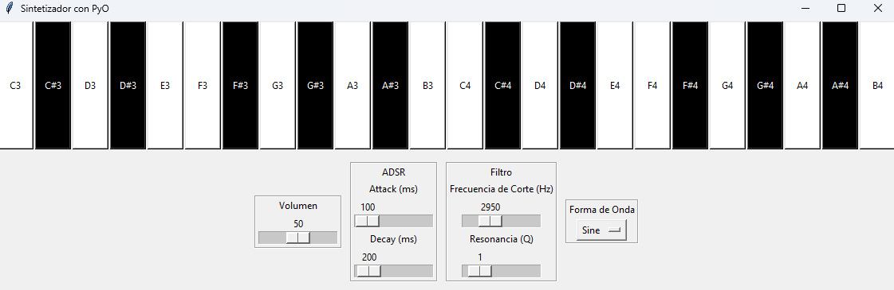

# Sintetizador con Python

Este repositorio contiene un proyecto de sintetizador musical utilizando Python, desarrollado para la asignatura [**ACUS220-20**](https://github.com/vpobleteacustica/ACUS220-Acustica-Computacional-con-Python) ("Acústica Computacional con Python").

El proyecto ha sido desarrollado por el **Grupo ELECTROACUSTIC**, conformado por los integrantes:

* **Nicolas Montes**, estudiante de Ingeniería Civil Acústica.
* **Vicente Pantanalli**, estudiante de Ingeniería Civil Acústica.
* **Josías Pinilla**, estudiante de Ingeniería Civil Acústica.
* **Areté Poffart**, estudiante de Ingeniería Civil Electrónica.

Estudiantes de la [Facultad de Ciencias de la Ingeniería](https://ingenieria.uach.cl/) de la Universidad Austral de Chile (UACh).

---
## Desarrollo

<!-- Para el desarrollo del sintetizador, inicialmente crearon 2 prototipos, uno de ellos con la biblioteca Pyo y el otro con las bibliotecas Tkinter y Sounddevice. -->

La versión actual está desarrollada utilizando las bibliotecas [Pyo](https://github.com/belangeo/pyo) y [Tkinter](https://docs.python.org/3/library/tkinter.html).

---
## Vista previa

A continuación, se muestra una vista previa (screenshot) de la interfaz gráfica de la aplicación desarrollada.

 

    

 

El código fuente se encuentra en `src/main.py`.

---
## Ejecución

1. Realice un clon de este repositorio.

`` git clone https://github.com/aretesatori/synth-python.git ``

2. Ingrese al repositorio clonado.

`` cd synth-python/ ``

3. Asumiendo que se tiene **Python** y **pip** instalados, ingrese el siguiente comando en terminal que permite instalar la biblioteca `Pyo` a través de `pip`.

`` pip install -r requirements.txt ``

**Nota**: Si utiliza algún entorno virtual para manejar bibliotecas en Python, asegúrese previamente de acceder al entorno.

4. Para ejecutar la aplicación, en el directorio raíz de este repositorio ejecute el siguiente comando.

`` python src/main.py ``
